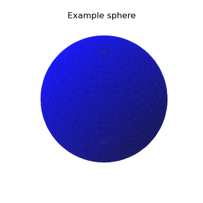
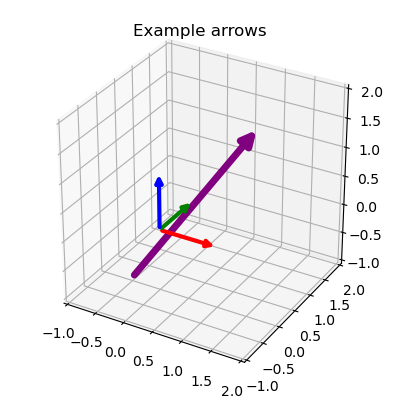

# Angle visualization
A few python tools for visualizing 3D angles and shapes with matplotlib.

## Installation

### Figure generation
To reproduce the figures shown below, install the additional requirements (seaborn) and run:
```bash
$ python -m README_figures.generate_figures
```
## Delaunay triangulation of a Fibonacci sphere
### Complete Delaunay triangulation for 3D shapes


### Triangulated Fibonacci sphere
#### Fibonacci sphere

The euclidean coordinates of a Fibonacci sphere can be generated using ```angle_visualization.triangulation.fibonacci_sphere```,

```python
# Generate the coordinates of a Fibonacci sphere with n_points points
from angle_visualization.triangulation import fibonacci_sphere
n_points = 1000
x, y, z = fibonacci_sphere(n_points)
```


#### Generating a triangulated Fibonacci sphere
```python
from angle_visualization.triangulation import Delaunay_Sphere
# Delaunay triangulation of the sphere
n_points = 3000
d = Delaunay_Sphere(n_points)
```

TODO: LIST OF ATTRIBUTES

#### Visualization


## Angle histogram on a sphere
### 3D angle histogram on a Fibonacci sphere


### 2D projection of the sphere


## Other 3D-shapes
### Sphere
```python
# Plot a sphere
sphere = angle_visualization.shapes.Sphere3D.add_sphere(
    radius=1.,
    origin=[0, 0, 0],
    steps=30,
    ax=ax, color="blue", alpha=.7,
)
```



### Arrows

`angle_visualization.shapes.Arrow3D` inherits from matplotlib's `FancyArrowPatch`. Plotting a single arrow an xyz origin can be done as follows:
```python
# Plot a single 3-dimensional arrow
arrow = angle_visualization.shapes.Arrow3D.add_arrow(
    2, .3, 3,
    origin=[-.5, 0, -1],
    color="purple",
    mutation_scale=20,
    arrowstyle="-|>",
    lw=5,
    adjust_ax_lim=False,
    ax=ax
)

# Plot an xyz origin in 3D
xyz = angle_visualization.shapes.Arrow3D.add_xyz(
    V=np.eye(3),
    origin=[0, 0, 0],
    mutation_scale=10,
    arrowstyle="-|>",
    lw=3,
    adjust_ax_lim=False,
    ax=ax
)
```



### Quaternions
