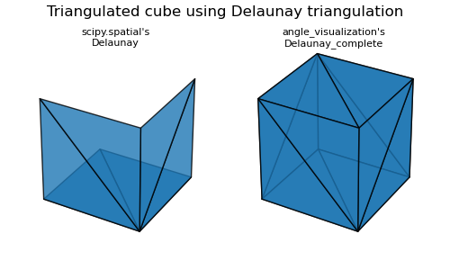
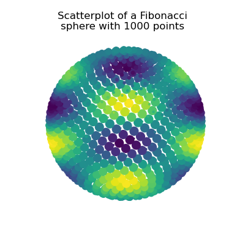
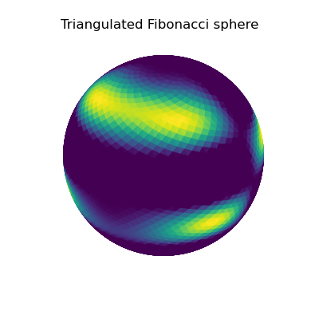
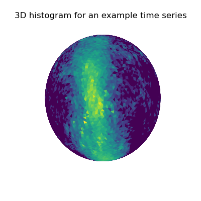
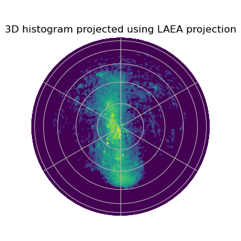

# Angle visualization
A few python tools for visualizing 3D angles with matplotlib.

## Installation

### Figure generation
To reproduce the figures shown below, install the additional requirements (seaborn) and run:
```bash
$ python -m README_figures.generate_figures
```
## Delaunay triangulation of a Fibonacci sphere
### Complete Delaunay triangulation for 3D shapes



### Triangulated Fibonacci sphere
#### Fibonacci sphere

The euclidean coordinates of a Fibonacci sphere can be generated using ```angle_visualization.triangulation.fibonacci_sphere```,

```python
# Generate the coordinates of a Fibonacci sphere with n_points points
from angle_visualization.triangulation import fibonacci_sphere
n_points = 1000
x, y, z = fibonacci_sphere(n_points)
```




#### Generating a triangulated Fibonacci sphere
```python
from angle_visualization.triangulation import Delaunay_Sphere
# Delaunay triangulation of the sphere
n_points = 3000
d = Delaunay_Sphere(n_points)
```

TODO: LIST OF ATTRIBUTES

#### Visualization




## Angle histogram on a sphere
### 3D angle histogram on a Fibonacci sphere


### 2D projection of the sphere



## Other 3D-shapes
### Sphere
### Arrows
### Quaternions
